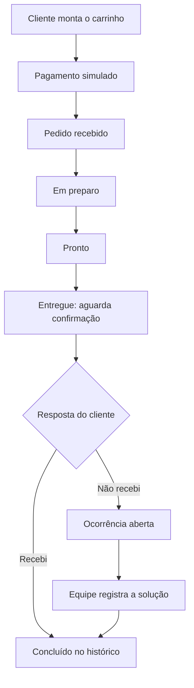

# Restaurant Flow System


Simulação de um fluxo de atendimento em restaurante, com aplicativo para o cliente, painel da equipe e API compartilhada. O cliente escolhe a mesa, monta o pedido e acompanha o preparo; a equipe gerencia o cardápio, atende os pedidos e resolve ocorrências de entrega.

> Projeto em desenvolvimento para demonstração e portfólio. Cardápio e pedidos são persistidos no MongoDB e sincronizados em tempo real. Autenticação e pagamentos são simulados, sem cobrança real.

## Funcionalidades

### Aplicativo do cliente

- Login e cadastro simulados, com credenciais de demonstração.
- Seleção de mesa e identificação do cliente no pedido.
- Cardápio com busca, categorias, faixa de preço e ordenação por preço.
- Produtos simples ou com acompanhamentos, sabores e tamanhos, incluindo opções obrigatórias e adicionais pagos.
- Carrinho com quantidades, observações, opções selecionadas, subtotais e total.
- Checkout demonstrativo com PIX ou cartão e cópia do código PIX de exemplo.
- Acompanhamento dos pedidos em tempo real, com pedidos ativos em destaque e histórico recolhido.
- Confirmação de recebimento ou registro de “Não recebi”, com exibição da solução registrada pela equipe.
- Interface escura adaptada para dispositivos móveis, também acessível pela web.

### Painel da equipe

- Acesso administrativo simulado.
- Fila de atendimento com indicadores por etapa e prioridade para ocorrências abertas.
- Avanço do pedido: recebido, em preparo, pronto e entregue.
- Visualizações de atendimento, ocorrências e histórico de pedidos concluídos.
- Registro da solução de ocorrências, com descrição, atendente e data.
- Criação manual de pedidos.
- Cadastro, edição e remoção de produtos, com preço, desconto, categoria, imagem e disponibilidade.
- Configuração de grupos de opções e acompanhamentos.
- Botão “Resetar Demo” para restaurar o cenário inicial.

### Backend

- API REST em Express, com persistência de cardápio e pedidos via Mongoose/MongoDB.
- Notificações por WebSocket para atualizar cliente e painel após alterações.
- Validação da sequência de status e das confirmações de entrega.
- Proteção contra resolução repetida ou concorrente de uma ocorrência.
- Seed do cardápio e rota para reinicialização da demonstração.

## Fluxo do pedido



Marcar um pedido como entregue ainda o mantém em atendimento até a confirmação do cliente ou a resolução de uma ocorrência. Quando a equipe resolve um caso, o relato original de não recebimento é preservado junto da solução.

## Tecnologias e estrutura

| Camada | Tecnologias |
| --- | --- |
| Cliente | React Native 0.81, React 19, Expo SDK 54, Expo Router, TypeScript e Context API |
| Dashboard | React 19, Vite 7, TypeScript, React Router DOM e Lucide React |
| Backend | Node.js, Express 4, Mongoose 8, MongoDB, dotenv e CORS |
| Comunicação | HTTP/REST e WebSocket em `/ws` |
| Validação | Node.js Test Runner, TypeScript e ESLint no cliente |

```text
restaurant-system/
├── backend/
│   ├── models/       # Modelos do MongoDB
│   ├── routes/       # API de cardápio, pedidos e reset
│   ├── seed/         # Cardápio inicial
│   ├── tests/        # Testes do fluxo de pedidos
│   └── server.js     # Servidor HTTP e WebSocket
├── cliente/
│   ├── app/          # Telas e rotas do Expo Router
│   ├── components/   # Cards, filtros, checkout e acompanhamento
│   ├── contexts/    # Sessão e carrinho
│   └── services/    # Integração com a API
├── dashboard/
│   ├── src/         # Painel da equipe e integração com a API
│   └── tests/       # Testes de classificação dos pedidos
└── README.md
```

## Executar localmente

### Pré-requisitos

- Node.js 24 e npm para executar os aplicativos e os testes com a mesma versão de runtime.
- MongoDB local ou uma conexão MongoDB Atlas acessível pelo backend.
- Para testar no celular: Expo Go compatível com o SDK do projeto ou uma build de desenvolvimento.

Execute os comandos a partir da raiz do repositório, usando um terminal separado para cada aplicação.

### 1. Backend

Crie `backend/.env` a partir de `backend/.env.example`. Se o arquivo já existir, ajuste a configuração existente. Exemplo para MongoDB local:

```dotenv
MONGODB_URI=mongodb://127.0.0.1:27017/restaurant-system
PORT=3333
```

Para Atlas, use a URI do seu banco em `MONGODB_URI`.

```bash
cd backend
npm install
npm run seed
npm run dev
```

O comando `npm run seed` substitui todos os itens do cardápio pelo catálogo inicial; use-o na preparação da demo. Ele não apaga os pedidos. Para iniciar sem recarregamento automático, use `npm start`.

A API fica disponível em `http://localhost:3333`, e o WebSocket em `ws://localhost:3333/ws`.

### 2. Dashboard

Crie `dashboard/.env` a partir de `dashboard/.env.example`:

```dotenv
VITE_API_URL=http://localhost:3333
```

```bash
cd dashboard
npm install
npm run dev
```

Abra o endereço informado pelo Vite no terminal, normalmente `http://localhost:5173`.

### 3. Cliente

Crie `cliente/.env` a partir de `cliente/.env.example`:

```dotenv
EXPO_PUBLIC_API_URL=http://localhost:3333
```

```bash
cd cliente
npm install
npm start
```

Use as opções do Expo no terminal para abrir o aplicativo. Para iniciar diretamente na web, execute `npm run web`.

No celular físico, configure `EXPO_PUBLIC_API_URL` com o IP do computador na rede, por exemplo `http://192.168.1.10:3333`, e mantenha os dispositivos na mesma rede. No emulador Android padrão, use `http://10.0.2.2:3333`. A porta da API precisa estar acessível ao dispositivo.

As URLs de configuração devem conter apenas a origem do backend, sem o sufixo `/api`. Reinicie o servidor do cliente ou do dashboard após alterar seu `.env`.

## Acessos de demonstração

| Perfil | E-mail | Senha |
| --- | --- | --- |
| Cliente | `email@email.com` | `123456` |
| Equipe | `admin@restaurante.com` | `admin123` |

Para experimentar o fluxo, entre como cliente, selecione uma mesa e finalize um pedido. No painel, avance as etapas até a entrega. Volte ao acompanhamento do cliente para confirmar o recebimento ou abrir uma ocorrência e resolvê-la pelo painel.

## Cardápio inicial com opções

Além dos produtos simples, o seed inclui:

| Produto | Opções | Acréscimo sobre o preço base |
| --- | --- | --- |
| Açaí | 300 ml (padrão) ou 500 ml | 300 ml: sem acréscimo; 500 ml: + R$ 6,00 |
| Refrigerante | Guaraná Antarctica ou Coca-Cola | Sem acréscimo |
| Suco | Maracujá, uva, morango ou laranja | Maracujá: sem acréscimo; uva: + R$ 4,00; morango: + R$ 3,00; laranja: + R$ 5,00 |
| Milkshake | Morango ou chocolate; 400 ml (padrão) ou 700 ml | Sabores e 400 ml: sem acréscimo; 700 ml: + R$ 8,00 |

## Verificações e build

Execute cada comando na pasta indicada:

| Pasta | Comando | Finalidade |
| --- | --- | --- |
| `backend` | `npm test` | Testar transições, confirmação e resolução de pedidos |
| `dashboard` | `npm test` | Testar a separação de pedidos ativos, ocorrências e histórico |
| `dashboard` | `npm run build` | Verificar TypeScript e gerar a build web em `dist/` |
| `dashboard` | `npm run preview` | Visualizar a build web gerada |
| `cliente` | `npx tsc --noEmit` | Verificar os tipos |
| `cliente` | `npm run lint` | Executar o ESLint |

Os testes do backend usam persistência em memória e validação dos modelos, sem acessar o MongoDB da demo. Detalhes das rotas e dos testes estão em [backend/README.md](backend/README.md).

## Escopo da demonstração

- Login e cadastro usam estado de sessão local; não há autenticação real nem controle de acesso na API.
- O checkout simula a aprovação. Não há integração com operadoras de cartão ou provedores de PIX.
- Cardápio e pedidos são persistidos no backend; sessão e carrinho ficam em memória no cliente.
- “Resetar Demo” apaga todos os pedidos e restaura o cardápio do seed, incluindo a substituição das edições feitas no painel.
- As opções “Mais pedidos” e “Novidades” aparecem nos filtros, mas ainda não possuem ordenação específica; a ordenação implementada é por preço.

## Próximas melhorias

- Ampliar os testes de interface para cobrir a jornada completa entre cliente e equipe.
- Refinar acessibilidade e comportamento em diferentes tamanhos de tela.
- Implementar critérios de popularidade e novidade para os filtros.
- Melhorar a recuperação da sessão e do carrinho após recarregar o aplicativo.

## Autor

**Ezequiel Borges**

- GitHub: [kiellzz](https://github.com/kiellzz)
- LinkedIn: [ezequielborgesdev](https://www.linkedin.com/in/ezequielborgesdev)
